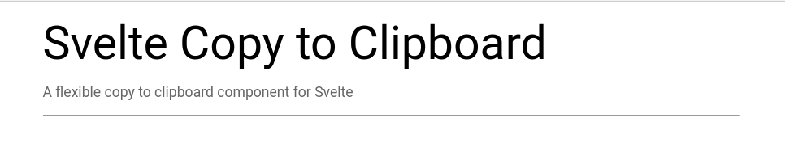

[](https://badge.fury.io/js/svelte-copy-to-clipboard)
[](https://opensource.org/licenses/MIT)
[](https://travis-ci.com/henriquecaraujo/svelte-copy-to-clipboard)

## Installation

```
npm i svelte-copy-to-clipboard
// OR
yarn add svelte-copy-to-clipboard
```

[LIVE DEMO](https://svelte-copy-to-clipboard.netlify.com/)

Local demo:

```
git clone https://github.com/henriquecaraujo/svelte-copy-to-clipboard.git
cd svelte-copy-to-clipboard
yarn && yarn dev
```

## Examples

```js
<script>
  import CopyToClipboard from "svelte-copy-to-clipboard";
  let exampleText = 'Copy me!';

  const handleSuccessfullyCopied = (e) => {
      alert(`successfully copied to clipboard! ${e}`);
  }

  const handleFailedCopy = () => {
      alert('failed to copy :(');
  }
</script>

<CopyToClipboard text={exampleText} on:copy={handleSuccessfullyCopied} on:fail={handleFailedCopy} let:onCopy>
    <button on:click={onCopy}>An element to trigger the copy</button>
</CopyToClipboard>
```

## Properties

Component props:

| Prop | Type   | Description             |
| ---- | ------ | ----------------------- |
| text | string | Value to copy           |
| copy | func   | Call when text's copied |
| fail | func   | Call when copy fails    |

## Slot Properties

| Prop   | Type   | Description   |
| ------ | ------ | ------------- |
| onCopy | string | Call foi copy |

## NPM Statistics

Download stats for this NPM package

[](https://nodei.co/npm/svelte-copy-to-clipboard/)

## License

Svelte Copy to Clipboard is open source software [licensed as MIT](https://github.com/henriquecaraujo/svelte-copy-to-clipboard/blob/master/LICENSE).
